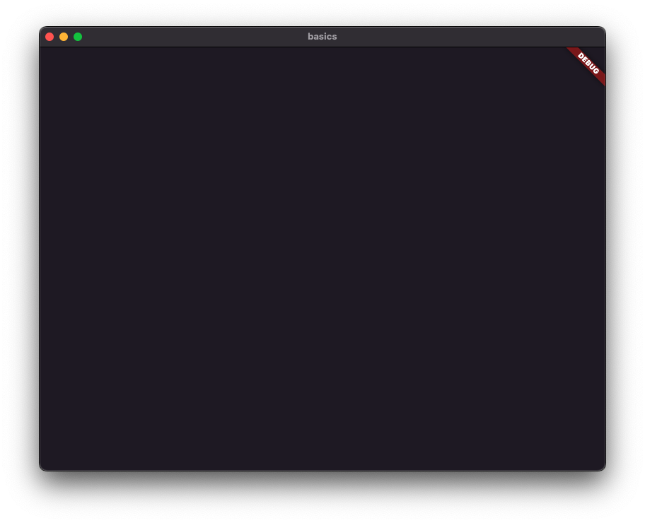
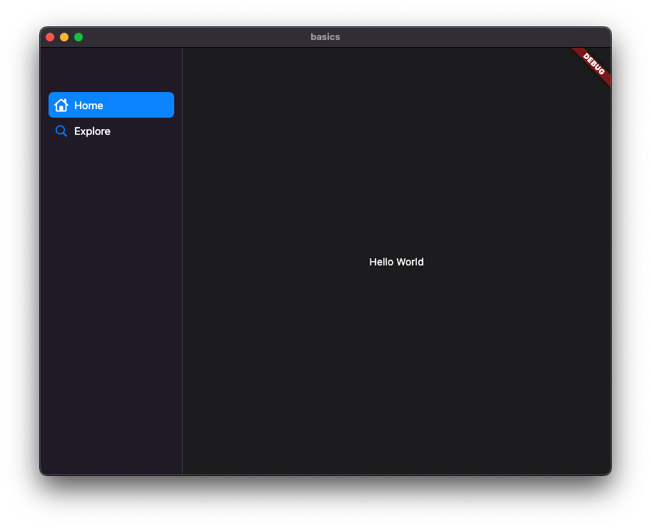

:::tip
This codelab walks you through witing your first Flutter application for macOS using `macos_ui`. If you are new to Flutter, you might want to begin with Flutter's ["Write your first Flutter app"](https://docs.flutter.dev/get-started/codelab) or ["Write your first Flutter app on the web"](https://docs.flutter.dev/get-started/codelab-web) codelabs. 
:::

## Step 1: Create the starter Flutter app

Create a simple, templated Flutter app using the instructions found using the method of your choice. You can follow the instructions found in [Getting Started with your first Flutter app](https://docs.flutter.dev/get-started/test-drive#create-app). Name the project "basics".

## Step 2: Add `macos_ui`

1. Add `macos_ui` to your `pubspec.yaml` file using the instructions found in [Installation](./installation).
2. Delete all of the code from **lib/main.dart** and replace it with the following:
```dart title="main.dart" showLineNumbers
import 'package:flutter/cupertino.dart';
import 'package:macos_ui/macos_ui.dart';

void main() {
  runApp(const MyApp());
}

class MyApp extends StatelessWidget {
  const MyApp({Key? key}) : super(key: key);

  @override
  Widget build(BuildContext context) {
    return MacosApp(
      theme: MacosThemeData.light(),
      darkTheme: MacosThemeData.dark(),
      themeMode: ThemeMode.system,
    );
  }
}
```

:::info
The first thing you might notice is that we are importing *both* `cupertino` and `macos_ui`. This is because `macos_ui` does not export any of Flutter's built-in libraries via the `macos_ui.dart` library file. As such, in order to use things like `StatelessWidget` and `ThemeMode` you'll have to import `cupertino` or `material`. We're going with `cupertino` so that we can use `CupertinoIcons` later on.
:::

:::caution
When using the `material` library in conjunction with `macos_ui`, be careful not to use any widgets like `ListTile` that require a `Material` ancestor in the widget tree. `macos_ui` offers alternatives to such widgets, like `MacosListTile`, that avoid such conflicts.
:::

3. Run the app [in the way your IDE describes](https://docs.flutter.dev/get-started/test-drive). Select "macOS (desktop)" as your build target.

Once the app finishes building you should see the following window:


:::note what is a `MacosApp`?

A `MacosApp` is a widget that represents an application that uses the macOS design system. It should be the root of your application's widget tree, and is comparable to Flutter's `MaterialApp` and `CupertinoApp` from the `material` and `cupertino` widget libraries, respectively.

As with `MaterialApp` and `CupertinoApp`, `MacosApp` acts as a convenience wrapper around widgets that are commonly required for a Flutter application that is intended to look and feel like a native macOS application, and provides certain defaults, like themes and scrolling physics. While you could certainly use `macos_ui` widgets and themes without using a `MacosApp`, it would be quite messy to do so; therefore, it is **strongly** recommended that you place a `MacosApp` at the root of your widget tree rather than a `MaterialApp` or other comparable widgets.

`MacosApp` is built on top of a `CupertinoApp`. All the properties you'd expect a `CupertinoApp` to have are available for a `MacosApp`, such as `builder`, `navigatorKey`, `routes`, and `localizationsDelegate`. To view the full list of `MacosApp`'s available properties, please see the [technical documentation](https://pub.dev/documentation/macos_ui/latest/macos_ui/MacosApp-class.html) on pub.dev.

If at this point you are wondering how to manage targeting multiple platforms while using the appropriate widget libraries (such as `material` for mobile, `fluent_ui` for Windows, and `macos_ui` for macOS), all of which expect their own root application widget, don't fret - this can be done relatively easily and there is a special codelab for this.
:::

## Step 3: Add some UI

It's pretty common for macOS applications to have the following: 
* A main content area 
* A resizable sidebar with navigational items that change what is shown in the main content area

Let's create some UI that reflects this common practice using `macos_ui`.

### Create the `MyHomePage` widget

A widget with a content area and a resizable sidebar is fairly complex. Thankfully, `macos_ui` abstracts all that away using the `MacosWindow` widget.

:::note What is a `MacosWindow`?
A `MacosWindow` is a basic layout widget that handles top-level UI layout for you. In addition to providing the main content for your app, you can use it to give your app a `Sidebar` and a `Titlebar`.
:::

```dart title="main.dart" showLineNumbers
import 'package:flutter/cupertino.dart';
import 'package:macos_ui/macos_ui.dart';

void main() {
  runApp(const MyApp());
}

class MyApp extends StatelessWidget {
  const MyApp({Key? key}) : super(key: key);

  @override
  Widget build(BuildContext context) {
    return MacosApp(
      theme: MacosThemeData.light(),
      darkTheme: MacosThemeData.dark(),
      // highlight-next-line
      home: const MyHomePage(),
    );
  }
}

// highlight-start
class MyHomePage extends StatefulWidget {
  const MyHomePage({Key? key}) : super(key: key);

  @override
  State<MyHomePage> createState() => _MyHomePageState();
}

class _MyHomePageState extends State<MyHomePage> {
  int _pageIndex = 0;
  @override
  Widget build(BuildContext context) {
    return MacosWindow(
      sidebar: Sidebar(
        minWidth: 200,
        builder: (context, scrollController) {
          return SidebarItems(
            currentIndex: _pageIndex,
            onChanged: (index) {},
            items: [],
          );
        },
      ),
      child: const Center(
        child: Text('Hello World'),
      ),
    );
  }
}
// highlight-end
```

### Add some items to the `Sidebar`

At this point we need to fill our `SidebarItems` with some actual `SidebarItem`s so that we can have something to click on:

```dart title="main.dart" showLineNumbers
import 'package:flutter/cupertino.dart';
import 'package:macos_ui/macos_ui.dart';

void main() {
  runApp(const MyApp());
}

class MyApp extends StatelessWidget {
  const MyApp({Key? key}) : super(key: key);

  @override
  Widget build(BuildContext context) {
    return MacosApp(
      theme: MacosThemeData.light(),
      darkTheme: MacosThemeData.dark(),
      home: const MyHomePage(),
    );
  }
}

class MyHomePage extends StatefulWidget {
  const MyHomePage({Key? key}) : super(key: key);

  @override
  State<MyHomePage> createState() => _MyHomePageState();
}

class _MyHomePageState extends State<MyHomePage> {
  int _pageIndex = 0;
  @override
  Widget build(BuildContext context) {
    return MacosWindow(
      sidebar: Sidebar(
        minWidth: 200,
        builder: (context, scrollController) {
          return SidebarItems(
            currentIndex: _pageIndex,
            onChanged: (index) {},
            // highlight-start
            items: const [
              SidebarItem(
                leading: MacosIcon(CupertinoIcons.home),
                label: Text('Home'),
              ),
              SidebarItem(
                leading: MacosIcon(CupertinoIcons.search),
                label: Text('Explore'),
              ),
            ],
            // highlight-end
          );
        },
      ),
      child: const Center(
        child: Text('Hello World'),
      ),
    );
  }
}
```

:::note A closer look at `Sidebar` and `SidebarItems`
#### `Sidebar`
The `Sidebar` is a configuration class that lets you set the properties of your app's sidebar area.
The `minWidth` is required, and is the minimum width the sidebar can be as it is being resized. Check out the [technical documentation](https://pub.dev/documentation/macos_ui/latest/macos_ui/Sidebar-class.html) to see all the ways you can customize your sidebar!

#### `SidebarItems`
`SidebarItems` is a scrollable widget that builds `SidebarItem`s and tracks the index of the currently selected `SidebarItem`. You can pass it the `builder`'s `scrollController` to have direct control over its scrolling behavior.

Check out the technical documentation for [`SidebarItems`](https://pub.dev/documentation/macos_ui/latest/macos_ui/SidebarItems-class.html) and [`SidebarItem`](https://pub.dev/documentation/macos_ui/latest/macos_ui/SidebarItem-class.html) to learn more!
:::

Do a hot **restart** of your app. Your app should now look like this:


At this point, clicking on the sidebar items doesn't result in anything happening. This is because we are not doing anything in `SidebarItem`'s `onChanged` function, so let's take care of that like by adding the following code to that empty function:

```dart
onChanged: (index) {
  setState(() => _pageIndex = index);
},
```

Perform a hot reload. Now, if you click on the sidebar items, they will appropriately become the currently selected item.

### Update the main content area

At this point we need to change the content being shown when navigation is performed. To do that, we need to remove the `Center` widget that is the `child` property of our `MacosWindow` and replace it with an `IndexedStack`. We'll then add two `MacosScaffold` widgets two represent our two "pages" that we can navigate between by using the sidebar.

:::note what is a `MacosScaffold`?
A `MacosScaffold` is what you might consider a "page" in an app. It provides a basic structure with which to lay out content in your app at a lower level than a `MacosWindow`, but at a higher level than common layout widgets like `Stack`, `Column`, and `Row`. In this way, it is similar to the `material` library's `Scaffold` widget and the `cupertino` library's `CupertinoPageScaffold` widget.
:::

```dart title="main.dart" showLineNumbers
import 'package:flutter/cupertino.dart';
import 'package:macos_ui/macos_ui.dart';

void main() {
  runApp(const MyApp());
}

class MyApp extends StatelessWidget {
  const MyApp({Key? key}) : super(key: key);

  @override
  Widget build(BuildContext context) {
    return MacosApp(
      theme: MacosThemeData.light(),
      darkTheme: MacosThemeData.dark(),
      home: const MyHomePage(),
    );
  }
}

class MyHomePage extends StatefulWidget {
  const MyHomePage({Key? key}) : super(key: key);

  @override
  State<MyHomePage> createState() => _MyHomePageState();
}

class _MyHomePageState extends State<MyHomePage> {
  int _pageIndex = 0;
  @override
  Widget build(BuildContext context) {
    return MacosWindow(
      sidebar: Sidebar(
        minWidth: 200,
        builder: (context, scrollController) {
          return SidebarItems(
            currentIndex: _pageIndex,
            onChanged: (index) {
              setState(() => _pageIndex = index);
            },
            items: const [
              SidebarItem(
                leading: MacosIcon(CupertinoIcons.home),
                label: Text('Home'),
              ),
              SidebarItem(
                leading: MacosIcon(CupertinoIcons.search),
                label: Text('Explore'),
              ),
            ],
          );
        },
      ),
      // highlight-start
      child: IndexedStack(
        index: _pageIndex,
        children: [
          MacosScaffold(
            children: [
              ContentArea(
                builder: ((context, scrollController) {
                  return const Center(
                    child: Text('Home'),
                  );
                }),
              ),
            ],
          ),
          MacosScaffold(
            children: [
              ContentArea(
                builder: ((context, scrollController) {
                  return const Center(
                    child: Text('Explore'),
                  );
                }),
              ),
            ],
          ),
        ],
      ),
      // highlight-end
    );
  }
}
```

:::caution Be Aware
`MacosScaffold` widgets only accept two types of `children`: `ContentArea` and `ResizablePane`. The `children` property can only contain **one** `ContentArea` but can included multiple (or zero) `ResizablePane`s.
:::

:::tip
It's a good idea to break out the widgets you're using as the `children` of your `IndexedStack` into their own classes.
:::

At this point, your application is fully interactive - when you click on an item in the sidebar, the content area will be udpated appropriately.

## Next Steps

Congratulations!

You've written your first Flutter application for macOS using `macos_ui`! Try out some more codelabs, check out the rest of the documentation, or just start building! 
